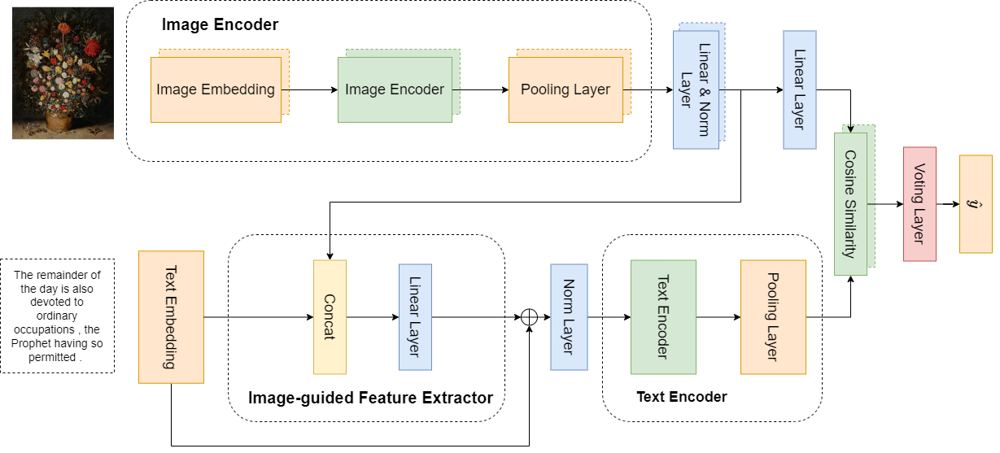

# Handle the problem of ample label space by using the Image-guided Feature Extractor on the MUSTI dataset

## Musti: Multimodal Understanding of Smells in Texts and Images (MMM2024)

### Introduction

The code aims to develop a model that can identify correlations between images and text based on scent.

#### Requirements

This code built with the following libraries

- Python 3.8 or higher
- Pytorch 1.8 or higher
- Transformers
- tqdm
- CUDA 10.0 or higher
- Scikit-Learn
- Focal loss torch
- Pillow

Installation

```
!git clone https://github.com/Haru-Lab-Space/MMM2024.git
cd MMM2024
!pip install -r requirements
```

### Method



- Image Encoder: The image encoder is a set of encoders of the Vision Transformer and Resnet-34 models.
- Text Selection Feature (TSF): This processing block aims to focus the text encoder on essential features by leveraging the comparatively smaller set of features required. Instead of relying solely on the expansive capabilities of the text encoder, we utilize the output from the image encoder to guide and narrow down the text embedding to crucial features. By sequentially appending the text embedding to the image encoding unit outputs, a linear classifier determines the extent to which information from the image encoder is retained. This process essentially acts as an "instructor" for the text encoding unit, directing attention to important and necessary features.
- Text encoder: We use BERT multilingual base model.

### Result

Performance of different methods for data imbalance problem on development set.

| Model                           | Negative Samples (F1-score) | Positive Samples (F1-score) | Avg    |
| ------------------------------- | --------------------------- | --------------------------- | ------ |
| ResNet101 + BERT + Entropy Loss | 0.8118                      | 0.5362                      | 0.6740 |
| ResNet101 + BERT + Focal Loss   | 0.8414                      | 0.5022                      | 0.6718 |
| Yolov5 + BERT                   | 0.8719                      | 0.6134                      | 0.7427 |
| Our (𝛾 = 2, 𝛼 = 0.3)            | 0.8976                      | 0.6530                      | 0.8419 |

Performance of different methods for data imbalance problem on test set.
|Model| F1-score|
|----|----|
|Yolov5 + BERT|0.6033|
|Our (𝛾 = 2, 𝛼 = 0.25)|0.7196|
|Our (𝛾 = 2, 𝛼 = 0.3)|0.7442|

### Training

```
!jupyter nbconvert --execute training.ipynb
```

### Testing

```
!jupyter nbconvert --execute predict.ipynb
```

file weight: https://drive.google.com/file/d/1C02JW2dCKN_IpoGnFadRr9RXH62fyuH2/view?usp=sharing